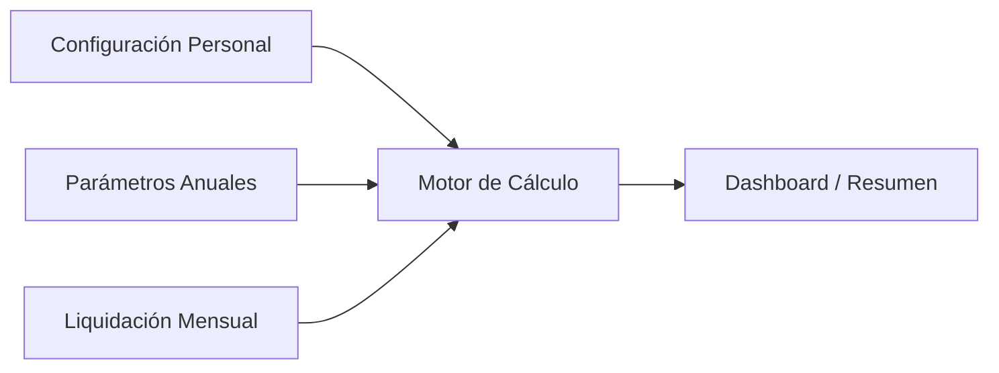

# Arquitectura y Diseño

## Arquitectura General

La aplicación tiene **3 módulos principales** que replican las 4 hojas del Excel:



## Estructura del proyecto

```
src/
├── engine/
│   ├── calculationEngine.js   # Motor de cálculo: 15 pasos ARCA Mapeo V3
│   └── defaultParams.js       # Parámetros 2025: escalas, deducciones, topes MoPRe
├── hooks/
│   └── useAppState.js         # Estado global + localStorage + import/export JSON
├── components/
│   ├── LiquidacionMensual.jsx # Pantalla principal: ingreso mensual + vista anual
│   ├── Dashboard.jsx          # KPIs + gráficos Chart.js + tabla Mapeo V3
│   ├── ConfigPersonal.jsx     # Cónyuge, hijos, tipo deducción especial
│   ├── ConfigParametros.jsx   # Editar escalas, deducciones, topes por semestre
│   └── Sidebar.jsx            # Navegación lateral con iconos
├── App.jsx                    # Router principal
├── main.jsx                   # Entry point
└── index.css                  # Design system (dark theme, glassmorphism, animaciones)
```

---

## Motor de Cálculo (`src/engine/`)

El corazón de la aplicación. Replica todas las fórmulas del Excel.

### `calculationEngine.js`

Motor completo con los **15 pasos del Mapeo V3**:

| Paso | Concepto |
|------|----------|
| 1 | Ganancia bruta del mes = Sueldo + Adicionales + Antigüedad + Comisiones + Plus Vacacional + Otros + No Rem Hab + No Rem No Hab + SAC |
| 2 | Retribuciones no habituales (con flag de prorrateo) |
| 3 | SAC Proporcional = Ganancia Bruta Acumulada / 12 |
| 4 | Descuentos obligatorios con tope MoPRe: Jubilación 11%, Obra Social 3%, INSSJP 3%, Sindicales |
| 5 | Deducción SAC |
| 6-8 | Ganancia neta del mes → acumulada |
| 9 | Deducciones personales (MNI, Cónyuge, Hijos, Deducción Especial + 22%) |
| 10 | Ganancia neta sujeta a impuesto = MAX(Acumulada - Deducciones, 0) |
| 11 | Impuesto por escalas progresivas Art. 94 (9 tramos, diferente Ene-Jun vs Jul-Dic) |
| 12-14 | Pagos a cuenta, retenciones anteriores, reintegros |
| 15 | Retención efectiva con tope 35% |

### `defaultParams.js`

Parámetros 2025 precargados desde el Excel:
- Deducciones personales (Ene-Jun y Jul-Dic)
- Escalas progresivas Art. 94 (9 tramos × 2 semestres)
- Topes MoPRe mensuales
- Topes de deducciones generales

---

## Componentes UI (`src/components/`)

### `ConfigPersonal.jsx`

Módulo de configuración personal (replica hoja "Configuración"):
- Toggle ¿Tiene cónyuge a cargo? (Sí/No)
- Input numérico: Cantidad de hijos
- Input numérico: Hijos incapacitados
- Selector: Tipo de Deducción Especial (General / Profesionales / Corredores-Viajantes / Antártida)

### `ConfigParametros.jsx`

Módulo de configuración de parámetros anuales (replica hoja "Parámetros"):
- Selector de año fiscal
- Tablas editables para:
  - Deducciones personales (por semestre)
  - Escalas progresivas Art. 94 (por semestre)
  - Topes MoPRe mensuales
- Botón "Restaurar valores por defecto 2025"

### `LiquidacionMensual.jsx`

La pantalla principal de ingreso de datos (replica hoja "Liquidación Anual"):
- **Vista por mes**: Formulario con todas las filas editables de un solo mes
  - Sección 1: Ingresos del mes (7 campos)
  - Sección 2: Pluriempleo (3 campos)
  - Sección 3: Descuentos calculados automáticamente
  - Sección 4: Deducciones generales (alquiler, prepaga, educación, etc.)
  - Sección 5: Resultados calculados (ganancia bruta, neta, impuesto, retención)
- **Vista anual**: Tabla resumen 12 columnas (como el Excel) de solo lectura
- Navegación por tabs entre meses
- Celdas input: fondo amarillo (como Excel)
- Celdas calculadas: fondo gris oscuro con valor dinámico

### `Dashboard.jsx`

Resumen visual con:
- KPIs: Total retenido acumulado, Sueldo neto promedio, Alícuota efectiva
- Gráfico de barras: Retención por mes
- Gráfico de línea: Evolución ganancia neta vs bruta
- Tabla resumen (replica hoja "Resumen cálculo")

### `Sidebar.jsx`

Barra de navegación lateral con iconos para cada módulo.

---

## Persistencia y Estado (`src/hooks/useAppState.js`)

Hook personalizado con:
- Estado global: configuración personal, parámetros, datos mensuales
- Auto-save a localStorage
- Import/Export a JSON
- Reset a valores por defecto

---

## Design System (`src/index.css`)

- Esquema de colores oscuro con acentos azul/violeta
- Tipografía Inter desde Google Fonts
- Variables CSS para tokens de diseño
- Glassmorphism en cards
- Micro-animaciones en inputs y transiciones
